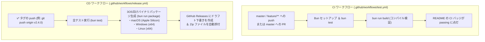

# リリースプロセスとデプロイ自動化ガイド

このドキュメントは、`twitch_text_to_speech_bot` におけるバージョニング規則、品質検証、GitHub Actions による CI/CD 自動化、およびリリース手順を定義した公式ガイドです。

---

## 1. セマンティックバージョニング方針 (SemVer)

本プロジェクトは [Semantic Versioning 2.0.0](https://semver.org/) に準拠し、`vMAJOR.MINOR.PATCH` 形式でバージョンを管理します。

| レベル | 変更の性質 | 例 |
| :--- | :--- | :--- |
| **MAJOR (X.0.0)** | 破壊的変更、下位互換性のないアーキテクチャ変更、大幅なUI/設定仕様の刷新 | `v2.0.0`, `v3.0.0` |
| **MINOR (2.X.0)** | 後方互換性を保った新機能の追加、新しい音声合成エンジンの追加、重要機能のアップデート | `v2.3.0` (動的加速・TTLスキップ)<br>`v2.4.0` (新ライブラリ移行・CI/CD) |
| **PATCH (2.4.X)** | 後方互換性を保ったバグ修正、辞書・発音パターンの微修正、軽微なパフォーマンス改善 | `v2.4.1` |

---

## 2. リリース前チェックリスト (Pre-release Verification)

リリースを行う前に、ローカル環境で以下のゲートをすべてクリアしていることを確認します。

1. **テストの全件パス**:
   ```bash
   bun test
   ```
   - ユニットテスト、統合テスト、ゴールデンマスターテスト（全テストケース）が 100% 成功（0 fail）すること。
2. **ビルド検証**:
   ```bash
   bun run build
   ```
   - TypeScript の型チェック、および単一バイナリ生成がエラー・警告ゼロで完了すること。
3. **作業ツリーのクリーン確認**:
   ```bash
   git status
   ```
   - 未コミットの余計な差分や残骸ファイルが存在しないこと。

---

## 3. GitHub Actions による CI/CD ワークフロー仕様

リポジトリには以下の 2 つの自動化ワークフローが組み込まれています。



### ① CI (`.github/workflows/test.yml`)
- **トリガー**: `master` および `feature/**` への push、`master` への Pull Request。
- **権限**: `contents: read`（最小権限）。
- **内容**: Ubuntu 上で Bun 環境を構築し、テストとビルドを実行して品質を保証。
- **ステータスバッジ**:
  ```markdown
  [](https://github.com/allpaqa-org/twitch_text_to_speech_bot/actions/workflows/test.yml)
  ```

### ② CD (`.github/workflows/release.yml`)
- **トリガー**: `v*` 形式のタグ push（例: `v2.4.0`）。
- **権限**: `contents: write`。
- **安全停止**: `bun test` が 1 件でも失敗した場合、後続のパッケージ作成・リリース作成は即時中断されます。
- **配布成果物**:
  - `twitch-tts-bot-mac-arm64.zip` (macOS Apple Silicon)
  - `twitch-tts-bot-windows-x64.zip` (Windows x64)
  - `twitch-tts-bot-linux-x64.zip` (Linux x64)
- **ドラフト運用 (`draft: true`)**: 自動で即時公開されず、必ず「ドラフト（下書き）」として作成されるため、リリースノートを目視確認した上で手動公開（Publish）できます。

---

## 4. リリース手順 (Release Runbook)

### Step 1: バージョンバンプ
`package.json` および `src/package.json` の `"version"` フィールドを新しいバージョン番号に更新します。

### Step 2: リリースコミットとタグ作成
```bash
# 変更をコミット
git add .
git commit -m "chore(release): vX.Y.Z"

# バージョンタグを作成
git tag vX.Y.Z
```

### Step 3: リモートへ Push
```bash
git push origin master --tags
```

### Step 4: Actions による自動ビルドの監視
Push 後、GitHub Actions の `Release` ワークフローが起動し、自動でテスト・ビルド・Zip 生成が行われます。
GitHub CLI から状況を確認できます：
```bash
gh run list --limit 3
```

### Step 5: ドラフトリリース本文の整形・確認
Actions が作成したドラフトリリースの本文を、新機能や変更点が分かりやすいように更新します（AI エージェント、または `gh release edit` を使用）：
```bash
gh release edit vX.Y.Z --title "vX.Y.Z - リリース名" --notes "変更内容..."
```

### Step 6: 正式公開 (Publish Release)
ブラウザで [GitHub Releases ページ](https://github.com/allpaqa-org/twitch_text_to_speech_bot/releases) を開き、作成されたドラフトの「Edit」➔「**Publish release**」ボタンを押して正式公開します。
